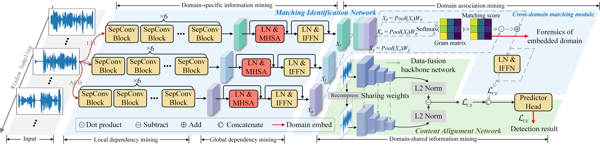

#  Universal Low Bit-Rate Speech Steganalysis Integrating Domain-specific and Domain-shared Knowledge
Code for TDSC 2025 paper:

[Universal Low Bit-Rate Speech Steganalysis Integrating Domain-specific and Domain-shared Knowledge](https://ieeexplore.ieee.org/document/10988577)

Hui Tian<sup>1,*</sup>, Yiqin Qiu<sup>2</sup>, Haizhou Li<sup>3</sup>, Xinpeng Zhang<sup>4</sup>, Athanasios V. Vasilakos<sup>5</sup>



## 📑 Outline

- [🏁 Quick Start](#-quick-start)
  - [⚙️ Installation Dependencies:](#️-installation-dependencies)
  - [📩 Prepare Dataset:](#-prepare-dataset)
  - [💻 Starting inference](#-starting-inference)
- [📚 License](#-license)
- [😊 Citation](#-citation)


## 🏁 Quick Start

### ⚙️ Installation Dependencies:

1. Installing anaconda and python (our version == 3.8.10).

2. Creating the new environment and install the requirements.

   ```
   conda create -n SepSteNet python=3.8
   
   conda activate UniversalStego
   
   pip install -r requirements.txt
   ```

------

### 📩 Prepare Dataset:

To train the model, you should extract coding parameters of your own speech samples to .txt files. Each row of .txt flies should contains [LPC param, FCB param, ACB param] of each frame in the speech sample.

Prepare with the file structure shown in `configs.py`.

Three steganography methods involved in our paper are as follows:

- B. Xiao, Y. Huang, and S. Tang, “An approach to information hiding in low bit-rate speech stream,” in Proc. Glob. Commun. Conf. (GLOBECOM), 2008, pp. 1–5.
- Y. Huang, C. Liu, S. Tang, and S. Bai, “Steganography integration into a low-bit rate speech codec,” IEEE Trans. Inf. Forensics Secur., vol. 7, no. 6, pp. 1865–1875, 2012.
- B. Geiser and P. Vary, “High rate data hiding in ACELP speech codecs,” in Proc. IEEE Int. Conf. Acoust., Speech Signal Process. (ICASSP), 2008, pp. 4005–4008.

------

### 💻 Starting inference

To train the model on your datasets:

```
python ./main.py --length xx --em_rate xx
```

The final results will be saved within log file.

## 📚 License

This project is released under the MIT license. See [LICENSE](https://github.com/BarryxxZ/UniversalStego/blob/main/LICENSE) for details.

## 😊 Citation

If you find the code and dataset useful in your research, please consider citing our paper:
```
@article{tian2025universal,
  title={Universal Low Bit-Rate Speech Steganalysis Integrating Domain-specific and Domain-shared Knowledge},
  author={Tian, Hui and Qiu, Yiqin and Li, Haizhou and Zhang, Xinpeng and Vasilakos, Athanasios V},
  journal={IEEE Transactions on Dependable and Secure Computing},
  year={2025},
  publisher={IEEE}
}
```
